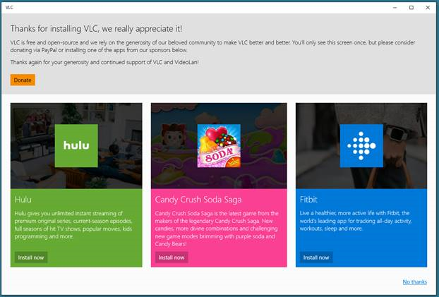
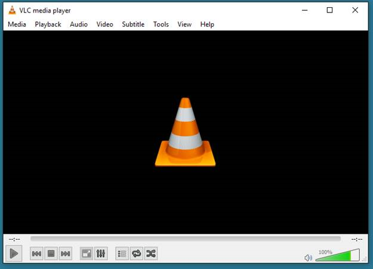
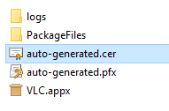
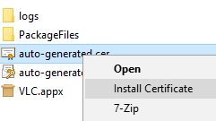
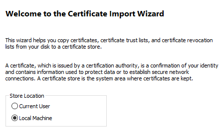
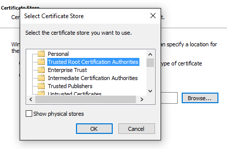
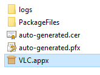
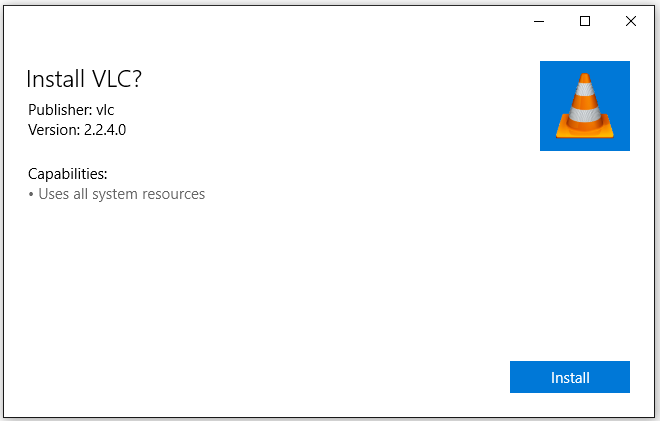
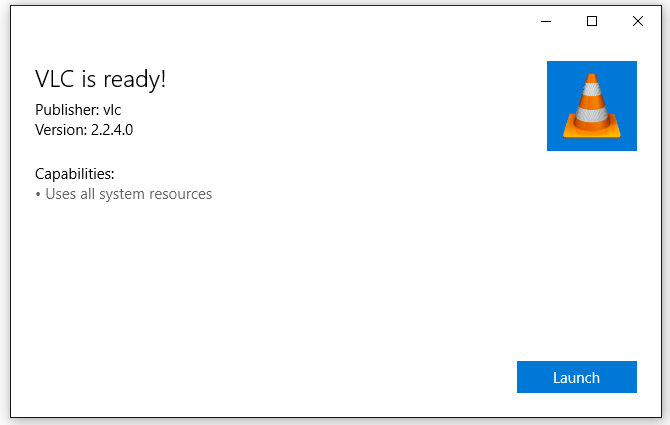

# VLC UWP Demo #

The VLC demo project wraps the Win32 [VLC media player](http://www.videolan.org/vlc/index.html) with a UWP app. The UWP app presents the user with several ads for other Windows Store apps, 
a Donate to VLC button, and a means to dismiss the Ad view and go directly to the VLC player. Selecting any option in the UWP front end will launch the VLC player and dismiss the UWP app.

A Windows 10 UWP AppX of this demo is [available](https://1drv.ms/u/s!ApzPPQxU0_aThvkECViK_7CGW83Arg). Note: This version is x64 only.

On launch (and eventually first launch only) of the VLC UWP app, the user is presented with the following UI:



Selecting any option on the page will launch the Win32 VLC player and termimate the VLC UWP app.



The VLC player (currently version 2.2.4) runs as a Win32 FullTrust application and therefore all of its features should be available to the user. (This needs to be fully tested)

The work to build this demo explored 2 areas:

1. Build VLC as a Centennial App with the [Desktop App Converter](https://docs.microsoft.com/en-us/windows/uwp/porting/desktop-to-uwp-run-desktop-app-converter)
1. Build VLC as a UWP app that contains all of the VLC files. Using the Desktop App Converter is not required.

The UWP VLC Demo app was built without using the Desktop App Converter. All of the VLC app files are contained in the UWP app. The Win32 VLC player app is launched from wihin the UWP app as a FullTrust process.

## How to convert VLC to a Centennial App using the Desktop App Converter##

Although the UWP VLC demo did not use the Desktop App Converter to create the demo app, the process for converting VLC to a Centennial App is documented below.

1. Install the [Desktop App Converter](https://docs.microsoft.com/en-us/windows/uwp/porting/desktop-to-uwp-run-desktop-app-converter)
1. Download the VLC player [installer](http://www.videolan.org/vlc/index.html) (currently v.2.2.4). There is no need to run the installer.
1. Run the Desktop App Converter as administrator.
1. Convert the VLC player to a Centennial App with the Desktop App Converter. The command below assumes you are in the directory where you downloaded the VLC installer.
    
``` console
DesktopAppConverter.exe -Installer .\vlc-2.2.4-win32.exe -InstallerArguments "/L=1033 /S" -Destination .\output -PackageName "VLC" -Publisher "CN=vlc" -Version 2.2.4.0 -MakeAppx -Verbose -Sign
```
* The InstallerArguments "/L=1033 /S" specify the english version of VLC (/L=1033) and a silent install (/S)

After the conversion is complete open the .\output\VLC\ folder. You will need to install the certificate created by the Desktop App Converter.
1. Right click on the auto-generated.cer file and select *Install Certificate*






You will add the certificate to Local Machine Trusted Root Certification Authorities



Select **Local Machine**. Click **Next**.




Click the **Browse** button and select **Trusted Root Certification Authorities**. Click **OK**. Click **Next**. Click **Finish**. The certificate is now installed.

You can now install the AppX of the VLC app. Double click on the VLC.Appx file.



Click on **Install** 



You can now launch the Centennial version of VLC



## Building the UWP VLC Demo App ##

The source code to the UWP VLC demo app is currently in a [private github repo](https://github.com/stammen/vlcdemo). Please email <dalestam@microsoft.com> with your github username to obtain
access to the source code.

1. Clone the vlcdemo github repo.

    ``` console
    git clone https://github.com/stammen/vlcdemo.git
    ```
    or with SSH
    ``` console
    git clone git@github.com:stammen/vlcdemo.git
    ```

1. cd vlcdemo

1. Install the VLC player files into the project
    ``` console
    .\get-vlc.bat
    ```


