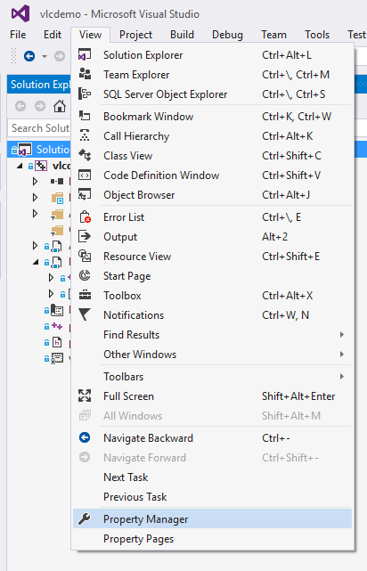
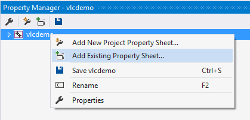
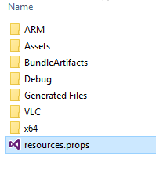
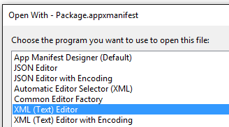

# VLC UWP Demo #

The VLC demo project wraps the Win32 [VLC media player](http://www.videolan.org/vlc/index.html) with a UWP app. The UWP app presents the user with several ads for other Windows Store apps, 
a Donate to VLC button, and a means to dismiss the Ad view and go directly to the VLC player. Selecting any option in the UWP front end will launch the VLC player and dismiss the UWP app.

A Windows 10 UWP AppX of this demo is [available](https://1drv.ms/u/s!ApzPPQxU0_aThvkECViK_7CGW83Arg). Note: This version is x64 only.

On launch (and eventually first launch only) of the VLC UWP app, the user is presented with the following UI:


Selecting any option on the page will launch the Win32 VLC player and termimate the VLC UWP app.


The VLC player (currently version 2.2.4) runs as a Win32 FullTrust application and therefore all of its features should be available to the user. (This needs to be fully tested)

The work to build this demo explored 2 areas:

1. Build VLC as a Centennial App with the [Desktop App Converter](https://docs.microsoft.com/en-us/windows/uwp/porting/desktop-to-uwp-run-desktop-app-converter)
1. Build VLC as a UWP app that contains all of the VLC files. Using the Desktop App Converter is not required.

The UWP VLC Demo app was built without using the Desktop App Converter. All of the VLC app files are contained in the UWP app. The Win32 VLC player app is launched from wihin the UWP app as a FullTrust process.

## How to convert VLC to a Centennial App using the Desktop App Converter##

Although the UWP VLC demo did not use the Desktop App Converter to create the demo app, the process for converting VLC to a Centennial App is documented below.

1. Install the [Desktop App Converter](https://docs.microsoft.com/en-us/windows/uwp/porting/desktop-to-uwp-run-desktop-app-converter)
1. Download the VLC player [installer](http://www.videolan.org/vlc/index.html) (currently v.2.2.4). There is no need to run the installer.
1. Run the Desktop App Converter as administrator.
1. Convert the VLC player to a Centennial App with the Desktop App Converter. The command below assumes you are in the directory where you downloaded the VLC installer.
    
``` console
DesktopAppConverter.exe -Installer .\vlc-2.2.4-win32.exe -InstallerArguments "/L=1033 /S" -Destination .\output -PackageName "VLC" -Publisher "CN=vlc" -Version 2.2.4.0 -MakeAppx -Verbose -Sign
```
* The InstallerArguments "/L=1033 /S" specify the english version of VLC (/L=1033) and a silent install (/S)

After the conversion is complete open the .\output\VLC\ folder. You will need to install the certificate created by the Desktop App Converter.
1. Right click on the auto-generated.cer file and select *Install Certificate*


You will add the certificate to Local Machine Trusted Root Certification Authorities


Select **Local Machine**. Click **Next**.


Click the **Browse** button and select **Trusted Root Certification Authorities**. Click **OK**. Click **Next**. Click **Finish**. The certificate is now installed.

You can now install the AppX of the VLC app. Double click on the VLC.Appx file.


Click on **Install** 


You can now launch the Centennial version of VLC


## Building the UWP VLC Demo App ##

The source code to the UWP VLC demo app is currently in a [private github repo](https://github.com/stammen/vlcdemo). Please email <dalestam@microsoft.com> with your github username to obtain
access to the source code.

1. Clone the vlcdemo github repo.

    ``` console
    git clone https://github.com/stammen/vlcdemo.git
    ```
    or with SSH
    ``` console
    git clone git@github.com:stammen/vlcdemo.git
    ```

1. cd vlcdemo

1. Install the VLC player files into the project

    ``` console
    .\get-vlc.bat
    ```
1. Open vlcdemo.sln. Select x86 or x64 for the platform. Select Debug or Release for the configuration. Build the solution.

## Coding Discussion ##

### Adding the VLC App Files to the Project ###

The following code was added to support launching VLC from the UWP app.

A resources.props file was added to the project to copy the VLC files to the AppX package. The resources.props file automates the adding of all of the VLC files. 
The resource.props file was added to the vlcdemo project as follows.

Select **Property Manager** from the **View** menu



Right click on vlcdemo and select **Add Existing Property Sheet...**



Select the file **resources.props** from the vlcdemo folder.



Now whenever a build of the vlcdemo project occurs, the VLC app files will be automatically copied to the AppX. This will also automate adding the VLC apps files when a Store Package is built.

### Adding the Win32 VLC application to the App Manifest ###

The vlcdemo UWP app needs to be able to launch the Win32 VLC app as a FullTrust application. In order to do this, the Win32 VLC app needs to be added to the Package.appxmanifest file.
The xml of the Package.appxmanifest file must be edited with a text editor. 

Right click on the Package.appxmanifest file file in the vlcdemo project. Select **Open With...** from the pop-up menu.


Select **XML (Text) Editor** from the list. Click **OK**.



In the XML editor add the following XML schemas to the <Package> tag

```xml
    xmlns:rescap="http://schemas.microsoft.com/appx/manifest/foundation/windows10/restrictedcapabilities"
    xmlns:desktop="http://schemas.microsoft.com/appx/manifest/desktop/windows10"
```
    
Add rescap and desktop to IgnorableNamespaces

```xml
    IgnorableNamespaces="uap mp rescap desktop"
```

We need to add VLC in an Application tag in the Applications section. I added the following:

```xml
    <Application Id="VLC" Executable="VLC\vlc.exe" EntryPoint="Windows.FullTrustApplication">
      <uap:VisualElements DisplayName="VLC" Square150x150Logo="Assets\AppMedTile.png" Square44x44Logo="Assets\AppList.png" Description="VLC" BackgroundColor="transparent" AppListEntry="none">
        <uap:DefaultTile Wide310x150Logo="Assets\AppWideTile.png" Square310x310Logo="Assets\AppLargeTile.png">
          <uap:ShowNameOnTiles>
            <uap:ShowOn Tile="square150x150Logo" />
            <uap:ShowOn Tile="wide310x150Logo" />
            <uap:ShowOn Tile="square310x310Logo" />
          </uap:ShowNameOnTiles>
        </uap:DefaultTile>
        <uap:SplashScreen Image="Assets\AppSplashScreen.png" BackgroundColor="black" />
      </uap:VisualElements>
    </Application>
```

It is important to note the **AppListEntry="none"** property in the uap:VisualElements element. This prevents the Win32 VLC app from appearing in the Windows application list. 
Only the UWP app will appear in the Windows applications list. We launch the Win32 VLC app with the UWP app.

Note: Some work will be needed with the above VLC Application tag to add the media filetypes supported by VLC. For example, if a user double clicks on a .wav file, VLC should be launched to play the file.

Note: The tiles specified in the Package.appxmanifest file were copied from the Centennial version of VLC generated with the Desktop App Converter.

### Launching VLC from the UWP App ###

Now that we have added the Win32 VLC app files to the project and the vlc.exe as a application to the Package.appxmanifest file, we can now launch vlc.exe from the UWP app.
In MainPage.xaml.cpp, take a look at the function 

```c++
void vlcdemo::MainPage::StartVLC(Windows::UI::Core::CoreDispatcher^ dispatcher)
{
    auto t = create_task(Windows::ApplicationModel::Package::Current->GetAppListEntriesAsync());
    t.then([dispatcher](IVectorView <Windows::ApplicationModel::Core::AppListEntry^>^ entries)
    {
        auto entry = entries->GetAt(1);
        auto t2 = create_task(entry->LaunchAsync());
        t2.then([dispatcher](bool)
        {
            dispatcher->RunAsync(Windows::UI::Core::CoreDispatcherPriority::Normal, ref new DispatchedHandler([=]()
            {
                Windows::UI::Xaml::Application::Current->Exit();
            }));
        });
    });
}
```

This function does 2 things. First it launches the vlc.exe as a FullTrust Win32 app. After the launch is complete, it exits the UWP app so only the Win32 VLC app is presented to the user.
This function uses the relatively undocumented Windows::ApplicationModel::Package::Current->GetAppListEntriesAsync() method to get the list of Applications specified in the Package.appxmanifest file.
Once we have the list, we get the AppListEntry for the vlc.exe (the 2nd position in the list) and call LaunchAsync() to launch vlc.exe. We then use the Windows::UI::Core::CoreDispatcher to terminate
the UWP app from the UI thread, allowing vlc.exe to launch before we terminate the UWP app.

The MainPage.xaml.cpp file contains all of the other functionality of the demo app including launching the Windows Store, the VLC donation page, etc.


      
